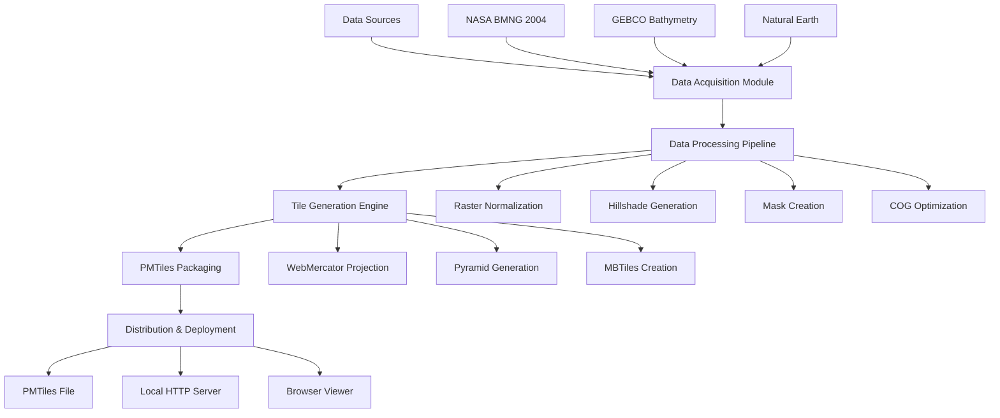

# Design Document

## Overview

Planetarble is designed as a comprehensive pipeline for generating global satellite imagery tiles from open data sources and packaging them into a single PMTiles file. The system follows a modular architecture with clear separation between data acquisition, processing, tile generation, and packaging phases. The design prioritizes reproducibility, air-gap deployment capability, and complete open-source compliance.

The core innovation is combining NASA Blue Marble Next Generation (BMNG) 2004 imagery with GEBCO bathymetry data and Natural Earth coastlines to create a visually appealing global basemap that can be distributed as a single file and viewed offline.

## Architecture

### System Components



### Data Flow Architecture

The system processes data through five distinct phases:

1. **Acquisition Phase**: Downloads and verifies open data sources
2. **Preprocessing Phase**: Normalizes, enhances, and optimizes raster data
3. **Projection Phase**: Converts to Web Mercator and generates tile pyramid
4. **Packaging Phase**: Creates PMTiles archive with metadata
5. **Deployment Phase**: Enables offline viewing and distribution

## Components and Interfaces

### Data Acquisition Module

**Purpose**: Manages download and verification of open data sources

**Key Components**:
- Asset catalog manager for tracking data sources and versions
- Download orchestrator with retry logic and integrity verification
- License compliance checker ensuring proper attribution

**Interfaces**:
```python
class DataAcquisition:
    def download_bmng(self, resolution: str = "500m") -> Path
    def download_gebco(self, year: int = 2025) -> Path
    def download_natural_earth(self, scale: str = "10m") -> Path
    def verify_checksums(self, manifest: Dict) -> bool
    def generate_manifest(self) -> Dict
```

**Data Sources**:
- NASA BMNG: 500m/pixel preferred, 2km/pixel fallback
- GEBCO: Latest annual grid (15 arc-second resolution)
- Natural Earth: Land/ocean masks and coastlines (10m scale)

### Data Processing Pipeline

**Purpose**: Transforms raw data into optimized raster formats suitable for tiling

**Key Components**:
- Raster normalizer for color correction and band management
- Hillshade generator for bathymetric enhancement
- Mask generator for land/ocean boundaries
- COG optimizer for efficient access patterns

**Processing Steps**:
1. **BMNG Processing**: Verify coordinate system (EPSG:4326), apply subtle color enhancement (+5% saturation), ensure RGB band order
2. **GEBCO Processing**: Generate hillshade (315° azimuth, 45° elevation), create ocean bathymetry tint for 10-20% blending
3. **Natural Earth Processing**: Create land/ocean masks for tile optimization and transparency handling
4. **COG Creation**: Reorganize as Cloud Optimized GeoTIFF with internal tiling and overviews

**Interfaces**:
```python
class DataProcessor:
    def normalize_bmng(self, input_path: Path) -> Path
    def generate_hillshade(self, gebco_path: Path) -> Path
    def create_masks(self, natural_earth_path: Path) -> Path
    def create_cog(self, raster_path: Path) -> Path
    def blend_layers(self, base: Path, overlay: Path, opacity: float) -> Path
```

### Tile Generation Engine

**Purpose**: Creates Web Mercator tile pyramid from processed raster data

**Key Components**:
- Projection transformer (EPSG:4326 → EPSG:3857)
- Pyramid generator with configurable zoom levels
- Tile optimizer for format and quality settings
- MBTiles creator with metadata embedding

**Tile Specifications**:
- Projection: EPSG:3857 Web Mercator (±85.0511° clipping)
- Tile scheme: XYZ with 256px dimensions
- Zoom levels: 0-10 (baseline), optional 0-12 (extended)
- Formats: JPEG (quality 75-85) or WebP (25-34% smaller)
- Total tiles (z≤10): ~1.4M tiles, estimated 14-56GB

**Interfaces**:
```python
class TileGenerator:
    def reproject_to_webmercator(self, input_path: Path) -> Path
    def generate_pyramid(self, input_path: Path, max_zoom: int) -> Path
    def create_mbtiles(self, pyramid_path: Path, format: str, quality: int) -> Path
    def optimize_overviews(self, mbtiles_path: Path) -> None
```

### PMTiles Packaging System

**Purpose**: Converts MBTiles to PMTiles format with proper metadata

**Key Components**:
- MBTiles to PMTiles converter using PMTiles CLI
- Metadata manager for TileJSON-compatible information
- Verification system for integrity checking
- Attribution manager for license compliance

**Metadata Structure**:
```json
{
  "name": "Planetarble Global Imagery 2004 (BMNG+GEBCO)",
  "description": "Open-source global satellite imagery with bathymetry",
  "version": "1.0",
  "minzoom": 0,
  "maxzoom": 10,
  "bounds": [-180, -85.0511, 180, 85.0511],
  "center": [0, 0, 2],
  "attribution": "© NASA (Blue Marble Next Generation, 2004), Bathymetry: GEBCO, Coastlines: Natural Earth"
}
```

**Interfaces**:
```python
class PMTilesPackager:
    def convert_mbtiles(self, mbtiles_path: Path) -> Path
    def embed_metadata(self, pmtiles_path: Path, metadata: Dict) -> None
    def verify_integrity(self, pmtiles_path: Path) -> bool
    def generate_tilejson(self, pmtiles_path: Path) -> Dict
```

### Deployment and Viewing System

**Purpose**: Enables offline viewing and distribution of PMTiles

**Key Components**:
- PMTiles HTTP server for XYZ tile serving
- MapLibre GL integration for browser viewing
- Static file generator for air-gap deployment
- Simple HTML viewer for local verification

**Deployment Options**:
1. **Direct PMTiles**: Browser with MapLibre GL + pmtiles.js
2. **HTTP Server**: `pmtiles serve` for XYZ endpoints
3. **Static Export**: Pre-generated tile directories for basic servers

**Interfaces**:
```python
class DeploymentManager:
    def start_pmtiles_server(self, pmtiles_path: Path, port: int = 8080) -> None
    def generate_html_viewer(self, pmtiles_path: Path) -> Path
    def export_static_tiles(self, pmtiles_path: Path, max_zoom: int) -> Path
    def create_distribution_package(self, pmtiles_path: Path) -> Path
```

## Data Models

### Asset Manifest
```python
@dataclass
class AssetManifest:
    sources: Dict[str, AssetSource]
    generation_params: Dict[str, Any]
    created_at: datetime
    version: str

@dataclass
class AssetSource:
    name: str
    url: str
    file_size: int
    sha256: str
    license: str
    attribution: str
```

### Processing Configuration
```python
@dataclass
class ProcessingConfig:
    bmng_resolution: str = "500m"
    gebco_year: int = 2025
    natural_earth_scale: str = "10m"
    color_enhancement: float = 1.05
    hillshade_opacity: float = 0.15
    max_zoom: int = 10
    tile_format: str = "JPEG"
    tile_quality: int = 80
```

### Tile Metadata
```python
@dataclass
class TileMetadata:
    name: str
    description: str
    version: str
    bounds: Tuple[float, float, float, float]
    center: Tuple[float, float, int]
    minzoom: int
    maxzoom: int
    attribution: str
    format: str
    scheme: str = "xyz"
```

## Error Handling

### Data Acquisition Errors
- **Network failures**: Implement exponential backoff retry with configurable attempts
- **Checksum mismatches**: Re-download with alternative mirrors if available
- **Missing high-resolution data**: Automatic fallback to lower resolution versions
- **License compliance**: Strict validation of attribution requirements

### Processing Errors
- **Coordinate system issues**: Automatic SRS detection and assignment
- **Memory limitations**: Chunked processing for large rasters
- **Format incompatibilities**: GDAL driver validation and format conversion
- **Color space problems**: Automatic RGB normalization and gamma correction

### Tile Generation Errors
- **Projection failures**: Graceful handling of polar region clipping
- **Tile corruption**: Individual tile validation and regeneration
- **Storage limitations**: Configurable quality reduction and format optimization
- **Zoom level issues**: Dynamic adjustment based on source resolution

### PMTiles Packaging Errors
- **Conversion failures**: MBTiles integrity verification before conversion
- **Metadata corruption**: Schema validation and automatic correction
- **File size limits**: Configurable compression and tile skipping strategies
- **Index corruption**: Automatic rebuild with PMTiles CLI verification

## Testing Strategy

### Unit Testing
- **Data acquisition**: Mock HTTP responses and checksum validation
- **Processing pipeline**: Test raster operations with synthetic data
- **Tile generation**: Verify projection accuracy and tile boundaries
- **PMTiles packaging**: Test metadata embedding and integrity checks

### Integration Testing
- **End-to-end pipeline**: Complete workflow with sample datasets
- **Format compatibility**: Test JPEG, WebP, and PNG tile formats
- **Zoom level validation**: Verify tile pyramid consistency
- **Cross-platform compatibility**: Test on Linux, macOS, and Windows

### Performance Testing
- **Memory usage**: Monitor peak memory consumption during processing
- **Processing time**: Benchmark each pipeline stage
- **File size optimization**: Compare compression ratios across formats
- **Tile serving performance**: Load testing for HTTP endpoints

### Quality Assurance
- **Visual inspection**: Automated sampling of generated tiles
- **Metadata validation**: Schema compliance and attribution accuracy
- **License compliance**: Automated checking of attribution requirements
- **Reproducibility**: Verify identical outputs from same inputs

### Acceptance Testing
- **Air-gap deployment**: Test complete offline functionality
- **Browser compatibility**: Verify MapLibre GL integration
- **Mobile responsiveness**: Test on various screen sizes
- **Performance benchmarks**: Ensure acceptable loading times

## Security Considerations

### Data Integrity
- SHA256 verification for all downloaded assets
- Digital signatures for distribution packages where applicable
- Tamper detection for PMTiles files

### Air-Gap Security
- No external dependencies during offline operation
- Local-only HTTP serving without external network access
- Secure handling of temporary files during processing

### License Compliance
- Automated attribution verification
- Clear documentation of usage rights and restrictions
- Audit trail for all data sources and transformations